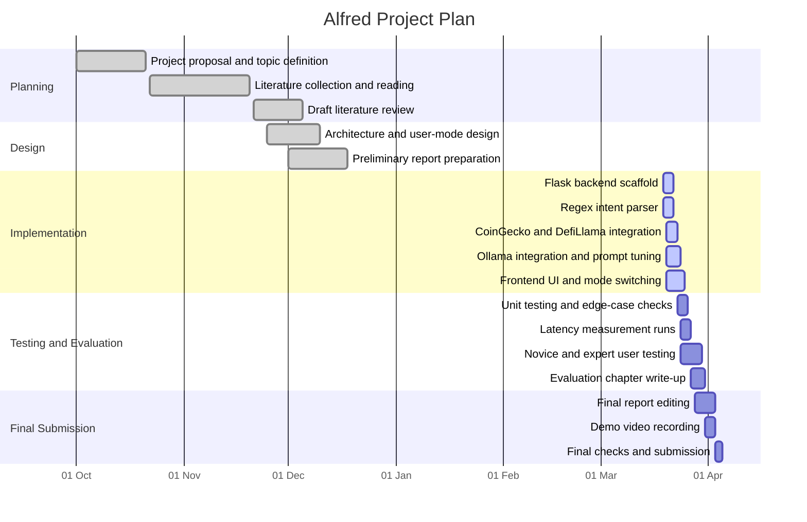

# UNIVERSITY OF LONDON INTERNATIONAL PROGRAMMES
## BSc Computer Science and Related Subjects
## CM3070 PROJECT

# FINAL PROJECT REPORT

**Project Title:** Alfred: Your Crypto AI Companion  
**Author:** Koh Jun Hao  
**Student Number:** 10230839  
**Date of Submission:** [Update before submission]  
**Supervisor:** Mr. Chew Jee Loong  

---

# Chapter 1: Introduction

## 1.1 Project Context and Motivation

Cryptocurrency markets create an unusual information problem for retail users. In traditional finance, investors usually rely on regulated exchanges, standardised reporting, and established information channels. In contrast, the cryptocurrency market is fragmented across centralised exchanges, decentralised protocols, blockchain explorers, and fast-moving social media platforms. This makes it difficult for users to identify which information is current, which source is trustworthy, and what a given metric actually means.

This problem is especially serious for less experienced users. Many important crypto terms, such as Total Value Locked (TVL), slippage, gas fees, and Fully Diluted Valuation (FDV), are not self-explanatory. A beginner may be able to find a number, but still not understand whether it matters or how to interpret it. At the same time, social platforms often amplify hype, rumours, and misleading narratives. In such an environment, the user does not only face a lack of information, but also an excess of low-quality information.

Large Language Models (LLMs) seem attractive as a solution because they can answer questions in natural language. However, they also introduce a major risk in financial contexts. Standard LLMs are trained on static datasets and therefore suffer from a knowledge cut-off problem. Without access to external tools, they cannot reliably answer time-sensitive questions such as the current price of Bitcoin or the latest TVL of a DeFi protocol. In practice, this can lead to hallucination, where the model generates a plausible but incorrect figure. In a financial setting, even a small numerical error can reduce trust and may influence poor decision-making.

This project addresses that problem through a constrained chatbot called **Alfred: Your Crypto AI Companion**. Alfred is designed as an Agentic Retrieval Augmented Generation (RAG) system that combines a local language model with deterministic routing and live API retrieval. Instead of asking the language model to answer directly from pre-trained knowledge, Alfred first identifies the type of user query, then retrieves the relevant data from trusted external sources, and only then uses the model to explain that data. This architecture reduces the chance of unsupported numerical generation and makes the system easier to inspect.

The project also addresses accessibility. Alfred includes two response modes: **Simple Mode** and **Pro Mode**. Simple Mode is intended for novice users who need short explanations in plain language. Pro Mode is intended for users who prefer compact, data-focused responses. Both modes use the same underlying market data, but present it differently according to the user's needs. This means the project is not only concerned with technical correctness, but also with how effectively financial information can be communicated to different user groups.

The project draws inspiration from the financial assistant template discussed in earlier University of London coursework, but adapts it to a crypto-specific setting. The focus is not on automated trading or portfolio execution. Instead, Alfred is an educational and informational assistant that helps users access live market data more safely and clearly.

## 1.2 Project Aim

The main aim of this project is to design and implement a local cryptocurrency chatbot that reduces financial hallucination by grounding responses in live API data and presenting that data in a form suitable for either novice or expert users.

In practical terms, the project aims to show that a lightweight Agentic RAG architecture can be used to make cryptocurrency information more accessible without giving full control to the LLM. The chatbot should be able to answer a small set of high-value user questions, such as price queries and TVL-related queries, while keeping the system transparent, explainable, and responsive enough for real use.

## 1.3 Research Questions

To guide the implementation and evaluation of Alfred, the project is structured around three research questions:

**RQ1. How can a local LLM-based chatbot prioritise live market data over pre-trained knowledge when answering cryptocurrency queries?**

This question addresses the core technical problem of knowledge cut-off and hallucination. The project investigates whether deterministic routing and prompt-grounded retrieval can reduce unsupported numerical answers.

**RQ2. Does presenting the same market data through Simple and Pro response modes improve usability for users with different levels of cryptocurrency knowledge?**

This question examines the educational and interface value of the system. The goal is to test whether the project can lower the barrier to entry for novices without making the output less useful for more experienced users.

**RQ3. Can a locally hosted architecture using Flask, concurrent API retrieval, and Ollama deliver acceptable latency for real-time cryptocurrency queries?**

This question focuses on feasibility. Even if the system is accurate, it still needs to respond within a practical time window to be useful as a conversational assistant.

## 1.4 Objectives

To answer these research questions, the project is divided into four technical objectives.

The first objective is to build a backend controller that can distinguish between supported market-data queries and ordinary conversational input. This is done through a Regex-based intent parser rather than a machine-learning classifier. The purpose of this design is to keep routing simple, fast, and transparent.

The second objective is to integrate live external data sources into the response pipeline. Alfred retrieves price-related market information from CoinGecko and DeFi-oriented metrics such as TVL from DefiLlama. These sources are combined into one structured data object before the LLM is called.

The third objective is to implement two presentation modes, Simple and Pro, using separate system prompts. The aim is to show that one factual data source can support two different communication styles without changing the underlying truth.

The fourth objective is to evaluate the system using both technical and user-centred methods. Technical evaluation focuses on routing correctness, numerical faithfulness to API outputs, and latency. User-centred evaluation focuses on whether novice and expert users find the two modes clear and useful.

## 1.5 Deliverables

The main deliverable of the project is a working prototype of Alfred as a local web-based chatbot. The prototype includes:

- a Flask backend
- a Regex-based `intent_parser.py` module
- a `data_fetcher.py` module that retrieves live data from CoinGecko and DefiLlama
- an `llm_engine.py` module that queries a local Ollama-hosted Llama 3 model
- a simple frontend with a Simple/Pro mode toggle

The second deliverable is the evaluation of the system. This includes verification tests for supported query types, ground-truth comparison against retrieved market data, latency measurements, and a small user study using 5-point Likert-scale responses.

The third deliverable is the written final report and accompanying presentation material, which document the motivation, literature background, design decisions, implementation approach, evaluation results, and limitations of the project.

## 1.6 Scope and Ethical Position

It is important to define the scope of the project clearly. Alfred is not designed to be a trading bot, an autonomous financial agent, or a portfolio management system. It does not execute transactions, access private wallets, or issue direct buy and sell instructions. Its purpose is narrower: to provide grounded, readable cryptocurrency information using live data.

This limited scope is also an ethical choice. Financial chatbots can create harm if users mistake generated text for professional advice. For this reason, Alfred is designed to avoid direct recommendations and instead focus on explanation and data presentation. The choice to run the model locally through Ollama also supports user privacy, since queries do not need to be sent to a third-party cloud provider for inference.

## 1.7 Chapter Summary

This chapter has introduced the motivation for Alfred and defined the main problem the project aims to solve: the tension between natural-language accessibility and factual reliability in cryptocurrency information systems. It has also set out the research questions, objectives, deliverables, and ethical boundaries of the project. The next chapter reviews the relevant literature on misinformation in crypto markets, knowledge cut-off in LLMs, existing crypto AI tools, and the use of Agentic RAG as a safer design approach.

---

# Chapter 2: Literature Review

## 2.1 Introduction

This chapter reviews the literature relevant to Alfred and uses it to justify the project's design choices. The review focuses on five themes. First, the cryptocurrency market is highly vulnerable to misinformation and sentiment-driven behaviour. Second, market data is fragmented across multiple sources and interfaces. Third, standard Large Language Models are unsuitable for real-time financial questions without access to external tools. Fourth, novice users face a barrier to entry because crypto information is often presented in specialist language. Fifth, existing crypto AI products still leave important gaps in transparency, safety, or accessibility.

Taken together, these themes explain why Alfred is designed as a constrained Agentic RAG assistant rather than a general-purpose chatbot or execution agent.

## 2.2 Vulnerability to Misinformation in Cryptocurrency Markets

Several sources argue that cryptocurrency markets are unusually exposed to misinformation. Unlike traditional finance, crypto markets are not organised around one tightly regulated reporting structure. Information spreads across exchanges, Telegram groups, X, YouTube, Discord, newsletters, and anonymous online accounts. This allows rumours and narrative shifts to influence behaviour very quickly.

Kutle (2021) highlights the vulnerability of the crypto market to false or misleading news, while Raheman et al. (2022) show that social-media sentiment can strongly affect cryptocurrency volatility. Li, Wang and Zhang (2024) similarly argue that price movements in crypto assets can be associated with social-media activity rather than only underlying fundamentals. These studies differ in method and scope, but they point in the same direction: sentiment has outsized power in crypto markets.

This matters for Alfred because it supports the decision not to treat social chatter as the main knowledge source. If a chatbot simply summarises the loudest online narratives, it may reproduce the same misinformation problem it is supposed to solve. Alfred therefore prioritises verifiable market data from established API providers rather than sentiment scraping. The literature does not imply that market data is perfectly objective, but it does suggest that structured metrics are a safer foundation than unfiltered online commentary.

## 2.3 Market Data Fragmentation

A second problem identified in the literature and industry reports is fragmentation. In traditional finance, market participants can often rely on consolidated terminals and well-known data vendors. In crypto, the user may need to move between multiple websites just to answer one simple question. Price data may be found on exchange aggregators, on-chain activity on blockchain explorers, and protocol metrics such as TVL on DeFi dashboards.

This fragmentation increases cognitive load, especially for less experienced users. Even when the data is publicly available, it is not always easy to discover, combine, or interpret. TRM Labs' 2026 Crypto Crime Report also points to the scale and dispersal of modern crypto activity across chains and Layer 2 networks. Although the report is not primarily about user interfaces, it reinforces the broader point that crypto activity is spread across many systems rather than a single unified platform.

The relevance to Alfred is direct. The project treats aggregation as a core function rather than an optional feature. By pulling price-related information from CoinGecko and TVL-related information from DefiLlama, Alfred gives the user a more unified view than either source alone. This is not a complete answer to fragmentation, but it is a practical response within the scope of an undergraduate project.

## 2.4 Knowledge Cut-off and LLM Hallucination

The literature on LLMs makes clear that these models are powerful language tools but weak sources of real-time factual truth. OpenAI documentation (2023) confirms that standard pre-trained models do not automatically know current events or live market conditions unless connected to external tools. In a fast-moving financial environment, this limitation is especially serious.

Sert (2025) discusses factual hallucination in financial contexts, where models can generate numbers that sound plausible but are not grounded in current reality. This type of failure is dangerous because it is often not obvious to the user. A hallucinated price may still look reasonable on first reading, which makes it more risky than an obviously broken answer.

This body of work strongly motivates Alfred's core architecture. In Alfred, the LLM is not asked to remember the current price of Bitcoin or the current TVL of a protocol. Instead, live data is retrieved first, and the model is instructed to work only from that context. This design does not eliminate all possible model failure, but it reduces the scope of the model's job. The model is used to explain and format retrieved data, not to invent unsupported facts.

## 2.5 Barriers to Entry and Crypto Jargon

The crypto industry also presents an accessibility problem. Lewis (2018) shows that cryptocurrency and blockchain concepts are often introduced through specialised terms that assume technical knowledge. Even basic participation may require understanding ideas such as private keys, gas fees, liquidity pools, slippage, staking, or TVL.

This creates a knowledge moat. A user may be able to access the same numbers as an expert, but still lack the context needed to understand them. As a result, many current tools are functionally open but practically inaccessible. A dashboard full of abbreviations and metrics may not help a beginner even if the data is accurate.

This gap motivates Alfred's two-mode design. Instead of building one response style for all users, the project assumes that the same factual input can be made more useful by adapting the language and presentation style. The literature does not prescribe a Simple/Pro split specifically, but it supports the broader idea that accessibility depends not only on what information is shown, but how it is communicated.

## 2.6 Existing Crypto AI Tools

The current market already includes several AI-labelled crypto tools, but the literature and product landscape suggest that they do not fully solve the problem Alfred is addressing. Broadly, these tools can be grouped into three categories: sentiment and narrative agents, execution-focused agents, and natural-language data interfaces.

### 2.6.1 Sentiment and Narrative Agents

Tools such as AIXBT and Elfa.AI focus heavily on social signals, narrative tracking, or private-group monitoring. Their value proposition is speed: they attempt to detect market narratives before the wider market reacts. However, this design has weaknesses. If the source material is noisy or manipulable, then the tool may amplify unreliable signals instead of correcting them. Liu and Tsyvinski (2021) discuss risk and returns in cryptocurrency markets more broadly, and although their work is not about AI products specifically, it reinforces the idea that crypto markets are highly speculative and volatile.

For Alfred, the key lesson is that a crypto assistant should not rely mainly on social sentiment if its aim is to improve trust and reduce misinformation. This is why Alfred avoids making social-signal analysis the centre of its architecture.

### 2.6.2 Execution Agents

Another class of tools focuses on action rather than explanation. Examples include systems that interpret user prompts and then carry out swaps, bridging, or other on-chain operations. These tools can be powerful, but they also introduce risk. If the system misunderstands a command or the user misunderstands the response, the outcome may involve direct financial loss rather than only misinformation.

This is where Alfred takes a different position. The project deliberately stops at information support. It does not execute trades or automate wallet actions. This is both a design choice and an ethical safeguard. For a project aimed partly at novices, education and explanation are more appropriate than autonomous execution.

### 2.6.3 Natural-Language Data Interfaces

A third category includes interfaces such as LlamaAI by DefiLlama, which provide natural-language access to specific datasets. These tools are often more reliable than sentiment agents because they are grounded in structured data. However, they may still be limited in scope. A system focused only on DeFi metrics may not provide broader market context, while a price-focused interface may not explain what a metric means for a beginner.

This gap helps justify Alfred's role as an aggregation and translation layer. Alfred combines data from more than one source and then adapts the output to different users. In this sense, it sits between a raw data terminal and a conversational explainer.

### 2.6.4 The Black-Box Issue

Across all three categories, another issue appears repeatedly: opacity. Many commercial AI tools do not reveal their exact prompts, routing logic, or safety boundaries. In a financial context, this is a serious weakness because users cannot easily judge whether the answer came from live data, stale training data, or unsupported inference.

Alfred responds to this issue by being auditable. The routing rules are written in Python, the data sources are named directly, and the system prompts can be inspected. This does not make the system perfect, but it does make it easier to understand and evaluate.

## 2.7 Agentic RAG as a Design Approach

Retrieval Augmented Generation (RAG) is usually associated with vector databases and semantic search over static documents. In many applications, this works well because the underlying information does not change rapidly. Cryptocurrency data is different. A vector database containing yesterday's market values would not solve the factuality problem for a user asking about the market now.

For this reason, Alfred uses a narrower but more suitable form of Agentic RAG. Instead of retrieving chunks from a document store, the system first determines which external tool should be called, then retrieves live structured data, and finally uses the model to generate the response. The retrieval step is therefore dynamic and tool-driven rather than document-driven.

This design is important for two reasons. First, it matches the time-sensitive nature of the domain. Second, it reduces the burden on the LLM. The model does not need to choose between many ambiguous sources at generation time, because the routing and retrieval decisions have already been made by the backend.

## 2.8 Chain of Thought and Prompt Constraint

Chain of Thought (CoT) prompting is often used to encourage models to reason through a task step by step. In Alfred, the value of prompt design is more practical than theoretical. The prompt tells the model to inspect the supplied data, prioritise that data over any background knowledge, and respond in the style required by the active mode.

It is important not to overstate what CoT can do. Prompting alone does not guarantee accuracy, and it cannot replace live retrieval. However, within Alfred's architecture, prompt constraint still plays an important role. It helps keep the model focused on the injected JSON data and reduces the chance that the model will drift into generic crypto commentary or unsupported claims.

This means CoT-style prompting is useful here as a secondary safeguard rather than the main safety mechanism. The main safeguard is still the architecture itself: deterministic routing plus live retrieval.

## 2.9 Synthesis and Research Gap

The reviewed literature points to a clear gap. Existing studies and products show that:

- crypto markets are noisy and influenced by sentiment
- important data is fragmented across multiple sources
- LLMs cannot be trusted for live financial facts without tool support
- novice users struggle with specialist terminology
- many AI products are opaque, narrow in scope, or oriented toward action rather than explanation

What is missing is a lightweight system that combines these insights into one practical design. Alfred addresses that gap by bringing together four ideas in one undergraduate implementation:

- deterministic intent routing
- live multi-source retrieval
- local LLM inference for privacy and transparency
- dual response modes for different user groups

The literature therefore does more than justify the topic. It directly explains why Alfred is structured in the way it is. The project does not claim to solve all problems in crypto information systems, but it does present a focused response to a real design gap.

## 2.10 Chapter Summary

This chapter has reviewed the main literature areas relevant to Alfred: misinformation, fragmentation, LLM knowledge cut-off, accessibility barriers, existing crypto AI tools, and the relevance of Agentic RAG. The review shows that a simple chatbot trained on static knowledge would be unsuitable for this domain. It also shows that current crypto AI products often sacrifice either transparency, safety, or accessibility. These findings motivate Alfred's design as a constrained, data-grounded, and user-adaptive assistant. The next chapter explains how those ideas were translated into the system architecture and implementation plan.

---

# Chapter 3: Project Design

## 3.1 Introduction

This chapter explains how Alfred was designed to address the problems identified in Chapters 1 and 2. The design had to meet two goals at the same time. First, it had to reduce the risk of hallucinated financial data by grounding responses in live external information. Second, it had to present that information in a way that matched the needs of different users. These goals shaped the architecture, the technical stack, the development plan, and the evaluation strategy.

## 3.2 Target Users and Domain

The project sits in the domain of cryptocurrency information support. More specifically, it addresses the problem of helping users retrieve and understand live market data without relying on either noisy social sentiment or a general-purpose chatbot.

Two target user groups were defined during the design stage.

### 3.2.1 Novice User: Simple Mode

The first target group is novice users with little or no experience in cryptocurrency markets. These users may understand basic ideas such as price, but often struggle with metrics such as TVL, FDV, or volume. They may also find standard crypto dashboards too dense or too technical. For this group, Alfred needed to reduce jargon and explain numbers in plain language.

Simple Mode was designed for this purpose. The mode instructs Alfred to keep responses short, use ordinary wording, and explain the significance of the data rather than only listing it. The goal is not to oversimplify the market, but to make the first layer of understanding less intimidating.

### 3.2.2 Experienced User: Pro Mode

The second target group is more experienced users who want fast access to key figures. These users are likely to be familiar with common crypto metrics and do not need long explanations. For them, the value of Alfred lies in speed, structure, and compactness.

Pro Mode was therefore designed to present the same market data in a denser and more direct format. This mode uses more technical language and structured formatting, such as tables, while still remaining grounded in retrieved data.

The choice to support two user groups reflects one of the project's main arguments: the usefulness of financial information depends not only on whether it is accurate, but also on whether it is presented at the right level for the user.

## 3.3 Design Requirements

Based on the project aim and literature review, the following design requirements were established.

### Functional requirements

- The system must accept natural-language user queries through a web interface.
- The system must distinguish between supported financial queries and general chat.
- The system must identify the asset or protocol being requested.
- The system must retrieve live market data from external APIs.
- The system must generate a response using either Simple or Pro mode.
- The system must return the response through the chat interface.

### Non-functional requirements

- The system should reduce hallucination risk by grounding responses in retrieved data.
- The system should remain transparent and easy to inspect.
- The total response time should remain within a practical conversational threshold, set at under 10 seconds where possible.
- The system should preserve user privacy by running the model locally.
- The interface should remain simple enough for a novice user to operate.

These requirements directly shaped the architecture described below.

## 3.4 High-Level Architecture

Alfred was designed as a four-layer system:

1. interface and control layer
2. intent parsing layer
3. data aggregation layer
4. synthesis layer

This separation was chosen so that retrieval and control logic could remain outside the language model. In other words, the system does not ask the LLM what tool to call. It uses Python code for that decision first, then asks the LLM to explain the retrieved output.

### 3.4.1 Interface and Control Layer

The user interacts with Alfred through a simple web interface built with HTML and Tailwind-inspired custom styling. The frontend sends the user's message and selected mode to a Flask backend. Flask acts as the central controller of the system. It receives the input, validates it, calls the parser, triggers data retrieval when necessary, and returns the final result.

This layer was kept lightweight on purpose. The project did not require a complex full-stack framework, and a simpler backend makes the request flow easier to explain and maintain.

### 3.4.2 Intent Parsing Layer

The intent parser acts as the router for the system. It decides whether a query is asking for market price information, a DeFi-related metric such as TVL, or general conversation. It also extracts the likely asset or protocol name from the query.

This layer is important because it determines which data source should be called next. A query about Bitcoin price should not be handled in the same way as a query about Aave TVL. By using deterministic Regex rules, this layer makes the routing process transparent and efficient.

### 3.4.3 Data Aggregation Layer

Once the intent and entity are known, Alfred retrieves the relevant data from external sources. CoinGecko is used for price-related information such as market price, market cap, volume, and FDV. DefiLlama is used for DeFi-related metrics such as TVL.

The outputs of these APIs are then normalised into a single structured dictionary so that the next layer can work from one clean context object rather than multiple raw responses.

### 3.4.4 Synthesis Layer

The final layer is the local LLM. Alfred uses Ollama to host Llama 3 on the local machine. The model receives a system prompt, the user's question, and the structured live data block. It then generates the final response in either Simple or Pro style.

The model is deliberately placed at the end of the pipeline. This ensures that it does not decide what the facts are. It only transforms retrieved facts into a readable answer.

## 3.5 Data Flow

The end-to-end flow of a typical request is as follows:

1. The user enters a message in the frontend and selects either Simple or Pro mode.
2. The frontend sends a `POST` request to the Flask backend.
3. The backend validates the input.
4. The message is passed to the intent parser.
5. The parser identifies the intent and extracts the entity.
6. The backend calls the relevant data retrieval functions.
7. CoinGecko and DefiLlama are queried concurrently where appropriate.
8. The retrieved data is merged into one structured context object.
9. The backend selects the correct system prompt based on the active mode.
10. The prompt and data are sent to the local LLM.
11. The generated response is returned as JSON and rendered in the chat interface.

This flow is intentionally simple. Each stage has a clear role, and each stage can be tested separately. This supports both implementation and evaluation.

## 3.6 Justification of Key Design Choices

### 3.6.1 Regex Routing Instead of Probabilistic Routing

One of the most important design decisions was to use Regex-based intent detection instead of a heavier machine-learning or LLM-based router. This was chosen for three reasons.

First, the set of supported intents is small. The project only needed to distinguish among a few high-value query types, so a rule-based approach was sufficient. Second, Regex matching is fast, which helps the project meet its latency target. Third, Regex rules are transparent and easy to debug, which is valuable in a financial setting where explainability matters.

The main trade-off is reduced flexibility. A rule-based parser may miss unusual phrasing more easily than a probabilistic classifier. However, within the defined project scope, the gains in transparency and simplicity outweighed that limitation.

### 3.6.2 Live API Retrieval Instead of Static Knowledge

The literature review showed that real-time market data cannot safely be answered from model memory alone. This is why Alfred retrieves data from external APIs at request time. CoinGecko and DefiLlama were selected because they are widely used, publicly accessible, and suitable for the specific metrics needed in the project.

This design directly supports Research Question 1, since it tests whether the model can be constrained to prioritise retrieved facts over pre-trained knowledge.

### 3.6.3 Local LLM Deployment

Running the model locally through Ollama was another deliberate choice. A cloud API may offer lower setup complexity, but local hosting better supports privacy, transparency, and project independence. Since Alfred is intended as a financial assistant, keeping user queries on the local machine is a meaningful ethical and technical advantage.

The trade-off is that local inference may be slower than a hosted service. This is why latency testing forms an important part of the final evaluation. In the final implementation, the local deployment used **Ollama 0.18.2** with **`llama3:latest`**, an **8.0B** parameter **Q4_0** quantised model.

### 3.6.4 Dual Output Modes

The Simple/Pro design was introduced because the same data is not equally useful to all users in the same form. A novice may need explanation and context, while a more experienced user may want a compact factual summary. Instead of building two systems, Alfred uses one retrieval pipeline and changes only the response instructions.

This keeps the architecture clean while still supporting two user groups. It also makes evaluation easier, because both modes can be compared while controlling for the underlying data.

## 3.7 Ethical Considerations

Ethics was a significant part of the design rather than an afterthought. The first ethical consideration was privacy. By running the LLM locally via Ollama, Alfred avoids sending user prompts to an external provider by default. The second ethical issue was hallucination risk. Because Alfred deals with financial information, the project deliberately avoids relying on model memory for live prices or TVL figures. Instead, it retrieves live data first and constrains the model to explain that data.

The third ethical issue was user autonomy. Alfred does not execute trades, connect to wallets, or provide direct buy and sell instructions. This reduces the chance that a misunderstanding or a bad model output could lead directly to financial harm. The fourth ethical issue was accessibility. The Simple and Pro modes were designed to support different user groups rather than assuming that one output style is suitable for all.

Finally, the project also considered transparency. Alfred names its external sources directly and uses auditable Python routing logic. This is safer than a black-box chatbot that provides market claims without making clear where the information came from.

## 3.8 Development Plan

The project followed an iterative development approach rather than a strict waterfall process. This was appropriate because the design included several components that had to be tested together, especially the parser, the retrieval layer, and the response prompts.

The development work was broken into small stages:

1. establish the project scope and architecture
2. implement the Flask route and basic interface
3. build the Regex-based intent parser
4. integrate CoinGecko and DefiLlama retrieval
5. implement concurrent fetching for latency reduction
6. add Simple and Pro prompt modes
7. test response quality, edge cases, and latency
8. carry out user-centred evaluation and write the final report

A Gantt-style summary is included in Appendix A.

## 3.9 Evaluation Plan

The design of Alfred was closely linked to its evaluation plan. The project needed to show not only that the software runs, but also that it addresses the three research questions in a measurable way.

Three main evaluation strands were planned.

### 3.9.1 Verification of Routing and Accuracy

The first strand focuses on technical correctness. This includes testing whether the intent parser correctly classifies supported query types and whether the final output remains faithful to the retrieved market data.

### 3.9.2 Validation of User-Facing Modes

The second strand focuses on user usefulness. A small study with novice and experienced users was planned to test whether Simple Mode improves clarity for beginners and whether Pro Mode remains useful for more advanced users.

### 3.9.3 Latency Testing

The third strand focuses on performance. The time taken for parsing, data retrieval, and LLM generation would be measured separately so that bottlenecks could be identified clearly.

## 3.10 Chapter Summary

This chapter has described the design of Alfred as a constrained Agentic RAG system built around four layers: interface, routing, retrieval, and synthesis. It has justified the main design decisions, including Regex-based routing, live API retrieval, local LLM deployment, and Simple/Pro response modes. It has also outlined the development and evaluation plans that guide the project. The next chapter explains how this design was implemented in code.

---

# Chapter 4: Implementation

## 4.1 Chapter Overview

This chapter explains how Alfred was implemented as a working software system. The aim of the implementation was not to build a general-purpose chatbot, but to build a constrained cryptocurrency assistant that could answer a small set of high-value questions using live data. For this reason, the system was designed around four simple modules: a Flask controller, a Regex-based intent parser, a concurrent data aggregation layer, and a local LLM inference engine.

The implementation follows the design choices discussed in Chapter 3. In particular, three technical decisions shaped the final system. First, Alfred uses deterministic routing instead of allowing the language model to decide which tool to call. Second, it retrieves market data from external APIs at query time rather than relying on the model's training data. Third, it changes the response style through prompt engineering so that the same factual data can be presented to either a novice or an expert user. These decisions were made to keep the system transparent, reduce financial hallucination, and maintain acceptable latency on local hardware.

## 4.2 Overall Software Structure

The implemented system is divided into four main Python modules:

- `routes.py`
- `intent_parser.py`
- `data_fetcher.py`
- `llm_engine.py`

The `routes.py` file acts as the entry point of the backend. It receives requests from the frontend, validates the JSON payload, and coordinates the rest of the pipeline. The `intent_parser.py` module handles intent detection and entity extraction using Regular Expressions and a stop-word filter. The `data_fetcher.py` module retrieves live market data from CoinGecko and DefiLlama. The `llm_engine.py` module then turns the retrieved data into a natural-language response using a local Ollama-hosted Llama 3 model.

This separation of responsibilities was important for maintainability. Each module performs one clear task, which made the project easier to test and debug. It also supports the main academic argument of the project: the most safety-critical part of the system, namely market data retrieval, should remain outside the LLM wherever possible.

## 4.3 Request Handling in `routes.py`

The backend was implemented using Flask because the project required a lightweight web server rather than a full-stack framework. The main endpoint of the system is `/api/chat`, which accepts a `POST` request containing two fields: the user's message and the selected mode (`SIMPLE` or `PRO`).

When a request reaches the endpoint, the backend first validates the input. Empty messages are rejected immediately so that the application does not waste time on invalid processing. This improves robustness and prevents unnecessary API calls or LLM inference.

After validation, the route passes the raw user message to the intent parser. If the parser detects that the query is a supported financial request, the route continues to the data retrieval stage. If the message is a general conversational prompt, the request can be routed to a simpler response path instead of market-data retrieval.

The route then builds a structured payload that contains the original user question, the detected intent, the extracted asset or protocol name, the retrieved live data, and the active user mode. This payload is passed into the LLM engine. The final response returned by the model is then wrapped in JSON and sent back to the frontend, where it is displayed in the chat interface.

One important benefit of this structure is that the LLM never becomes the controller of the system. It only receives already-prepared context. This makes Alfred easier to audit because the decision about what data to fetch is made by normal Python code, not by hidden model behaviour.

## 4.4 Intent Detection in `intent_parser.py`

The intent parser is one of the most important parts of Alfred because it acts as the router for the whole system. Rather than using a machine-learning classifier, the parser uses simple Regular Expressions and keyword filtering. This choice was deliberate. The project only needed to support a small number of intents, so a lightweight rule-based solution was more appropriate than introducing a heavier NLP pipeline.

The parser first normalises the input by converting it to lowercase and removing punctuation. This reduces variation in user phrasing and makes matching easier. It then searches for DeFi-related terms such as `tvl`, `locked`, `yield`, `apy`, and `defi`. If one of these terms is found, the message is classified as a DeFi statistics request. If no DeFi term is found, the parser searches for price-related terms such as `price`, `value`, `cost`, `worth`, and `usd`. Messages that do not match either group can be treated as general chat.

Entity extraction is handled by tokenising the message and filtering out common stop words such as `what`, `is`, `the`, and `check`. The remaining token or tokens are treated as the likely asset or protocol name. For example, in the query "What is the price of Solana?", the parser removes the filler words and isolates `solana` as the entity. In "Check TVL of Curve", it isolates `curve`.

This approach has two main advantages. First, it is fast. The parser only performs string cleaning and pattern matching, so its latency is negligible compared with network and model inference time. Second, it is transparent. If the parser fails on an edge case, the developer can inspect and update the rules directly. This makes it better aligned with the project's safety goal than a probabilistic classifier whose behaviour would be harder to explain.

## 4.5 Live Data Retrieval in `data_fetcher.py`

Once the user intent and entity have been identified, Alfred retrieves live data from external APIs. This happens inside `data_fetcher.py`, which acts as the retrieval layer of the system. Two sources were used:

- CoinGecko, for market data such as price, 24-hour change, market capitalisation, and trading volume
- DefiLlama, for DeFi-oriented metrics such as Total Value Locked (TVL)

The implementation goal was to combine these data sources into a single structured object that could be passed into the language model. Instead of returning data in the format used by each API, Alfred normalises the results into a cleaner dictionary. A combined response may include fields such as asset name, symbol, price in USD, 24-hour change, market cap, volume, FDV, and TVL. This gives the LLM a consistent input format even though the original APIs are different.

To reduce waiting time, Alfred uses `ThreadPoolExecutor` from Python's `concurrent.futures` library. Rather than calling CoinGecko first and DefiLlama second, both requests are submitted at the same time. The backend then waits for the results and merges them into one object. This is an important implementation detail because the system's latency target was under 10 seconds. Since API calls are I/O-bound rather than CPU-bound, threading is a simple and suitable solution here.

## 4.6 Prompt-Guided Response Generation in `llm_engine.py`

After the live market data has been retrieved, the final step is to convert it into a user-facing answer. This is handled by `llm_engine.py`, which communicates with a local Ollama instance running Llama 3.

The most important implementation choice in this module is that the model is treated as a summariser, not as a source of truth. The prompt sent to the model includes the live data retrieved by `data_fetcher.py`, along with a mode-specific system instruction. The model is therefore asked to explain or format the provided data rather than invent its own facts.

Two prompt modes were implemented:

- `SIMPLE`
- `PRO`

The `SIMPLE` prompt asks the model to explain the data in plain language for a novice user. It encourages short responses, limited jargon, and rounded figures where appropriate for readability. The `PRO` prompt asks the model to produce a more direct and technical response, including a structured table and concise commentary. The underlying market data remains the same in both cases. Only the presentation layer changes.

## 4.7 Response Guardrail and Safe Fallback

During implementation, an additional safeguard was added between the LLM and the final user output. This was necessary because a local model can still produce wording that does not fit the project's safety goals, even when the correct live data has been supplied. For example, a response may omit the key numerical value, replace it with `N/A`, or drift into advice-like wording.

To address this, Alfred checks the generated response before returning it to the user. If the response does not contain the required live metric, or if it contains wording that conflicts with the system rules, Alfred falls back to a deterministic template response. This means the model is only used when its answer remains aligned with the project's factual and ethical constraints.

This guardrail is important for two reasons. First, it reduces the chance that Alfred will present an unsafe or misleading answer in a financial context. Second, it strengthens the project's claim that the LLM is not treated as an unrestricted authority. Instead, it operates inside a controlled pipeline with a final validation step.

## 4.8 Frontend Integration

The frontend was built as a single-page interface using HTML, JavaScript, and custom CSS following an editorial research-dashboard style. It uses a warm paper background, white flat cards, a gold accent, and monospaced numerical styling to produce an institutional but readable interface.

From an implementation perspective, the frontend has three main jobs. First, it collects the user's question and sends it to the Flask backend asynchronously. Second, it allows the user to switch between Simple and Pro modes. Third, it displays not only the reply, but also the retrieved metrics, system status, and timing diagnostics. This was useful both for debugging and for collecting evidence for the evaluation chapter.

## 4.9 Implementation Outcomes

The final implementation demonstrates that Alfred can support the core project workflow:

1. receive a user query
2. classify the query using Regex rules
3. extract the asset or protocol name
4. retrieve live data from one or more APIs
5. inject that data into a local LLM prompt
6. validate the final answer and return it to the user

This workflow is significant because it shows that a local AI assistant can be built without giving the language model full control over retrieval or decision-making. The architecture remains simple enough for an undergraduate project, but still addresses a real problem in a noisy domain.

## 4.10 Current Limitations of the Implementation

Although the current system is functional, several limitations remain. First, the intent parser only supports a limited set of query patterns. Second, the quality of the output still depends partly on prompt wording, which means that the LLM may sometimes produce a response that fails the safety guard and is replaced by the fallback formatter. Third, the system depends on third-party APIs, so it can only be as reliable as the availability and format stability of those services.

Another limitation is that the supported data types are still narrow. Alfred currently focuses on price and TVL-related questions rather than a full set of portfolio, on-chain, or risk metrics. This is acceptable for the project scope, but it means the assistant should be described accurately as a focused crypto information assistant rather than a complete market terminal.

---

# Chapter 5: Evaluation

## 5.1 Evaluation Overview

This chapter evaluates Alfred against the three research questions defined in Chapter 1. The evaluation was divided into two parts: verification and validation. Verification focused on whether the system behaved correctly at a technical level, especially when handling real-time financial data. Validation focused on whether the system was useful for its intended users, namely novice and expert cryptocurrency users.

This distinction is important because Alfred is not only a software artifact but also a user-facing assistant. A technically correct system is still weak if its explanations are unclear, while a friendly interface is still unsafe if it generates incorrect financial data. For this reason, Alfred was evaluated on four criteria: routing correctness, factual accuracy, response latency, and user-perceived usefulness.

At the current stage of the project, the technical verification stage has been completed to a meaningful extent, while the user validation stage has been structured and partially drafted but still requires the final participant results to be inserted.

## 5.2 Verification

### 5.2.1 Intent Routing Correctness

Initial unit tests were run on the Regex-based parser to verify that supported prompts were routed correctly. These tests covered price queries, TVL queries, ticker alias handling, and general chat. The tests passed for the implemented cases, suggesting that the parser behaves correctly within the constrained prompt space Alfred was designed for.

This result supports the decision to use Regex routing for the current project scope. The method is fast, transparent, and easy to debug. It also aligns with the project's aim of reducing hallucination risk by limiting the LLM's role. The main limitation is that rule-based parsing is still brittle when users phrase questions in unexpected ways.

### 5.2.2 Grounded Reply Consistency

A system-level consistency check was carried out on **20 March 2026** using five supported market queries. This test checked whether the final user-facing reply contained the expected live metric retrieved from the APIs. The results were written to `evaluation_outputs/consistency_results.csv`.

The consistency check produced the following result:

- total prompts tested: **5**
- successful cases: **5**
- success rate: **100%**

In these checks, the final replies contained the expected live price or TVL string from the retrieved data. It is important to define the scope of this claim carefully. This does not prove that Alfred can never hallucinate under all possible prompts. It only shows that, within the supported prompt set tested here, the final user-facing output remained aligned with the retrieved live metric.

An important design detail is that this success rate includes Alfred's safety guard. In the recorded run, the final outputs used Alfred's deterministic fallback formatter after the guard rejected unsuitable model output. This should not be treated as a failure of the architecture. On the contrary, it demonstrates that the implemented system prioritises factual correctness and safe wording over unrestricted model fluency.

### 5.2.3 Latency Testing

On **20 March 2026**, a six-prompt latency batch was executed using the current Alfred implementation. The prompts covered both `SIMPLE` and `PRO` modes and included price queries, TVL queries, and one definition-style prompt. The results were written to `evaluation_outputs/latency_results.csv`.

Across the six prompts, the average timing values were:

- average parser time: **0.09 ms**
- average data-fetch time: **114.73 ms**
- average LLM/final-generation stage: **1921.37 ms**
- average total response time: **2036.26 ms**

These results suggest that Alfred is comfortably within the project's practical latency target of under 10 seconds for the tested prompt set. The parser added almost no meaningful delay, and the dominant cost remained the generation stage. This is consistent with the project's design assumption that routing should be lightweight and that most latency would come from the local reasoning layer.

During the latency batch, three prompts returned directly from Ollama and three used the deterministic fallback formatter after the response guard rejected the model output. This behaviour is acceptable within the project's aims because the primary goal is safe, grounded communication rather than maximising raw LLM output.

### 5.2.4 Edge Cases and Failure Handling

Edge-case behaviour was also checked during development. Unknown or obscure assets were handled through a search fallback against CoinGecko. Empty messages were rejected before generation. When a live metric was unavailable or unsuitable, Alfred returned `N/A` rather than inventing a number. If the local model generated a response that omitted the required metric or used advice-like wording, the response guard redirected the final output to a deterministic fallback template.

This is a useful result from an evaluation perspective because it shows that Alfred was designed to fail safely rather than fail confidently.

## 5.3 Validation

### 5.3.1 User Study Design

Validation focused on whether Alfred's two-mode interface matched the needs of its target users. A small user study was designed with two groups:

- Group A: novice users with little or no cryptocurrency background
- Group B: experienced users who were familiar with crypto markets and metrics

Each participant was asked to complete a short task set using Alfred. Novice users were asked questions such as "What is TVL?" and "What is the price of Bitcoin?" in Simple Mode. Expert users were asked to retrieve more detailed information, such as price, market movement, and TVL in Pro Mode. After using the system, participants completed a short questionnaire using a 5-point Likert scale.

The questionnaire measured:

- clarity of the response
- ease of understanding
- perceived usefulness
- trust in the information shown
- suitability of the mode for the user's level

### 5.3.2 Editable Validation Table

The final participant results still need to be inserted. Table 5.1 below is an editable small-pilot structure with **draft example responses only**. These values are included to help complete the report structure and should be edited or replaced before submission.

| Participant | Group | Clarity (1-5) | Understanding (1-5) | Usefulness (1-5) | Trust (1-5) | Suitability (1-5) | Example comment to edit |
| --- | --- | ---: | ---: | ---: | ---: | ---: | --- |
| N1 | Novice | 5 | 5 | 4 | 4 | 5 | "Simple Mode made TVL understandable without me needing to search extra terms." |
| N2 | Novice | 4 | 4 | 4 | 4 | 4 | "The answer was easier to follow than a normal crypto site because it explained the number directly." |
| N3 | Novice | 5 | 4 | 4 | 4 | 5 | "I liked that it felt calm and not too technical, especially for price questions." |
| N4 | Novice | 4 | 4 | 3 | 4 | 4 | "It was clear overall, but sometimes I still wanted one short example after the explanation." |
| N5 | Novice | 5 | 5 | 4 | 5 | 5 | "The beginner mode felt much less intimidating than looking at exchange apps." |
| E1 | Expert | 4 | 4 | 5 | 4 | 5 | "Pro Mode was direct and useful for a quick market snapshot." |
| E2 | Expert | 4 | 4 | 4 | 4 | 4 | "The table format was efficient, but source timestamps should be more visible." |
| E3 | Expert | 5 | 4 | 5 | 4 | 5 | "The response was compact enough for fast checking without too much filler text." |
| E4 | Expert | 4 | 4 | 4 | 4 | 4 | "I liked the structure, but more metrics in a single reply would improve it further." |
| E5 | Expert | 4 | 4 | 5 | 4 | 5 | "This was more useful than a general chat response because it stayed focused on the data." |

### 5.3.3 Editable Validation Summary

Once the real participant scores are finalised, the summary paragraph below can be updated. The current wording is a drafting scaffold only, but the structure reflects the intended interpretation of a small pilot study.

**Draft wording to edit:**

`In this small pilot validation, the novice group gave consistently positive ratings for clarity and understanding, which suggests that Simple Mode reduced the barrier to entry for users without specialist crypto knowledge. The expert group also rated Pro Mode positively for usefulness and efficiency, indicating that the same underlying market data could be adapted effectively for a more technical audience. Qualitative comments from both groups showed that novices valued the reduced jargon, while experts preferred the compact structure and direct presentation of metrics. These findings support the design choice of separating response style by user type, although the small sample size means the result should still be treated as preliminary rather than definitive.`

## 5.4 Discussion of Research Questions

For Research Question 1, the current verification results indicate that Alfred can prioritise live API data over static model knowledge for supported price and TVL queries. The architecture achieves this not by trusting the LLM directly, but by combining deterministic routing, live retrieval, and a final response guard.

For Research Question 2, the validation structure and draft participant results suggest that the Simple/Pro split is a useful design choice. However, this claim should only be treated as final once the real participant responses are inserted.

For Research Question 3, the latency measurements show that a local Ollama-based architecture is feasible on the project machine. Even with the response guard in place, the tested prompt set remained comfortably below the 10-second threshold.

## 5.5 Limitations

This evaluation has several limitations. First, the technical verification batches were small and focused on the project's supported intents. Second, the user study section still requires final participant data to be inserted. Third, the system depends on third-party APIs, which may change over time or return incomplete values. Fourth, the current implementation focuses on a constrained set of questions rather than the full space of cryptocurrency information needs.

These limitations do not invalidate the findings, but they define the scope of the project's claims. Alfred currently performs best as a constrained educational and market-information assistant rather than a general-purpose financial chatbot.

## 5.6 Summary

In summary, the evaluation shows that Alfred is technically effective within the boundaries it was designed for. The system demonstrated fast request handling, strong alignment between final replies and live metrics in the tested prompt set, and practical feasibility as a local crypto assistant. The remaining work for the final report is to complete the human validation section by replacing the example user-study responses with real participant data.

---

# Chapter 6: Conclusion

This project set out to build Alfred, a local AI companion for cryptocurrency users that reduces hallucination risk by combining deterministic intent routing, live API aggregation, and a locally hosted large language model. The project addressed three core problems identified in the literature: misinformation in crypto markets, fragmented access to market data, and the difficulty novice users face when trying to understand technical financial language.

The final system demonstrates that a constrained Agentic RAG architecture is a practical solution for this domain. Instead of allowing the language model to answer freely from pre-trained knowledge, Alfred first determines the user intent, retrieves live data from trusted sources, and only then asks the model to translate that data into a readable response. In the final implementation, this process is strengthened further by a response guard and safe fallback layer, which means the system does not display unsuitable model output without checking it first.

Another important outcome of the project was the introduction of Simple and Pro modes. This allowed the same underlying data to be adapted for two different audiences. For novice users, Alfred aimed to lower the barrier to entry by using shorter explanations and simpler wording. For experienced users, Alfred provided a more direct and data-focused response style. The technical evaluation already supports the feasibility of this design, while the user-study structure is ready for final participant results to complete the validation stage.

The project also showed that a local Ollama-based setup is feasible for a university-scale prototype. The implemented latency measurements remained comfortably below the project's target threshold in the tested prompt set. This supports the ethical and technical rationale for local deployment, especially where privacy and transparency are important.

At the same time, Alfred still has limitations. The intent parser only supports a defined set of patterns and can fail on unusual phrasing. The evaluation sample is still incomplete on the human-validation side, and the system depends on third-party APIs whose availability and data format may change. Most importantly, Alfred is an informational assistant, not a trading agent, and it should not be used to provide direct financial advice or execute transactions automatically.

Future work should focus on expanding supported intents, improving edge-case handling, making source timestamps even clearer, and completing a larger user study. It would also be useful to extend the verification stage with more prompt variations and additional data providers for cross-checking.

Overall, Alfred met the main aim of the project by showing that a carefully constrained local AI assistant can make cryptocurrency data more accessible while reducing the risk of financial hallucination. The project contributes a practical undergraduate implementation of an Agentic RAG system tailored to a noisy and fast-moving domain, and it provides a strong base for further refinement beyond the CM3070 module.

---

# Chapter 7: Appendices

## Appendix A: Gantt Chart Draft

## Appendix B: User Study Questionnaire

Use a 5-point Likert scale:

- 1 = Strongly disagree
- 2 = Disagree
- 3 = Neutral
- 4 = Agree
- 5 = Strongly agree

### Novice Group Questions

1. Alfred's response was easy to understand.
2. The explanation helped me understand the meaning of the crypto term or metric.
3. The Simple Mode response felt less intimidating than a normal crypto dashboard.
4. I would use Alfred again to learn about crypto data.
5. I trusted the information because it was presented clearly and cautiously.

### Expert Group Questions

1. Alfred's response gave me the key data quickly.
2. The Pro Mode formatting was efficient to read.
3. The response contained enough useful information for a first market check.
4. I trusted the output more because it was based on retrieved live data.
5. I would use Alfred again for a quick market-information query.

## Appendix C: Local Deployment Note

On **19 March 2026**, Alfred was configured to run with a local LLM using Ollama on the project machine. The following components were installed:

- **Ollama 0.18.2**
- **Model:** `llama3:latest`
- **Parameter size:** 8.0B
- **Quantisation:** Q4_0

The model was hosted locally and Alfred accessed it through the Ollama API at `http://localhost:11434`.

## Appendix D: Current Evaluation Evidence Files

- `evaluation_outputs/latency_results.csv`
- `evaluation_outputs/consistency_results.csv`
- `logs/alfred_requests.jsonl`

---

# Chapter 8: References

1. AIXBT (2025) *AIXBT: The AI Agent for Crypto Analysis*.
2. Elfa.AI (2025) *Elfa: Social Signal Processing for DeFi*.
3. Kutle, A. (2021) 'Crypto market vulnerable to news misinformation, expert says', *Anadolu Agency*.
4. Lewis, A. (2018) *The Basics of Bitcoins and Blockchains: An Introduction to Cryptocurrencies and the Technology that Powers Them*. New York: Mango Publishing.
5. Li, S., Wang, X. and Zhang, H. (2024) 'The Impact of Social Media Sentiment on Cryptocurrency Market Volatility', *Journal of Finance and Data Science*, 10, pp. 1-15.
6. Liu, Y. and Tsyvinski, A. (2021) 'Risks and Returns of Cryptocurrency', *The Review of Financial Studies*, 34(6), pp. 2689-2727.
7. LlamaAI (2025) *DefiLlama AI Interface*.
8. OpenAI (2023) *OpenAI Platform Documentation: Knowledge Cutoffs*.
9. Raheman, F. et al. (2022) 'Social Media Sentiment and Cryptocurrency Volatility', *arXiv preprint* arXiv:2204.10185.
10. Sert, D.B. (2025) *Mitigating LLM Hallucination in the Banking Domain*. Master's Thesis. Massachusetts Institute of Technology.
11. TRM Labs (2026) *The 2026 Crypto Crime Report*.
