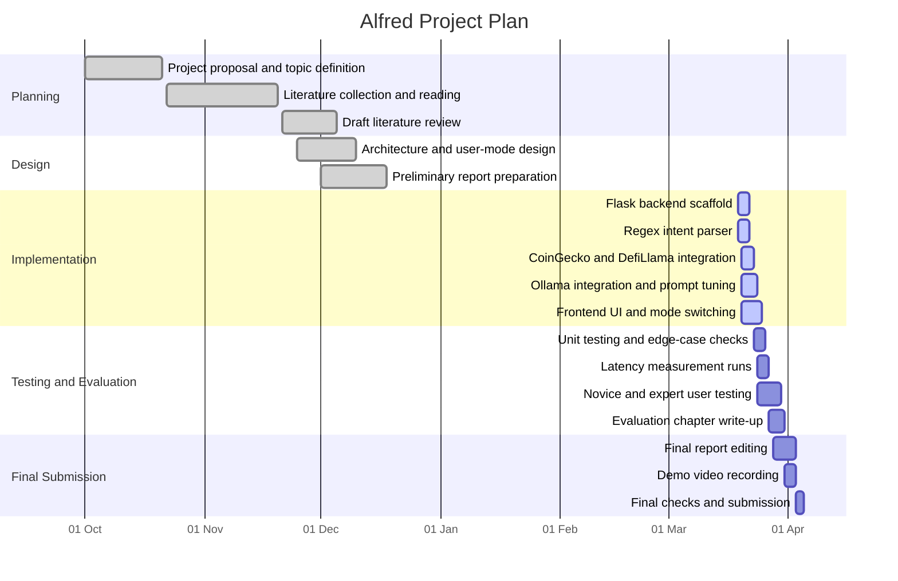

# CM3070 Gantt Chart Draft

Use this as the basis for your final project plan visual. You can convert it into a figure or table in the report.

Suggested sentence for the report:

`The project followed an iterative plan in which literature review, architecture design, implementation, and evaluation were developed in overlapping stages rather than as a strict linear waterfall process.`
